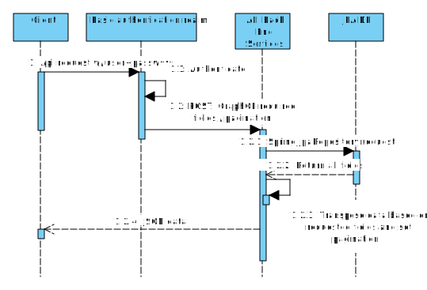
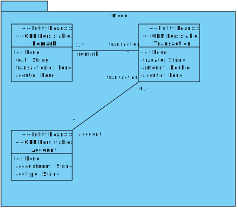
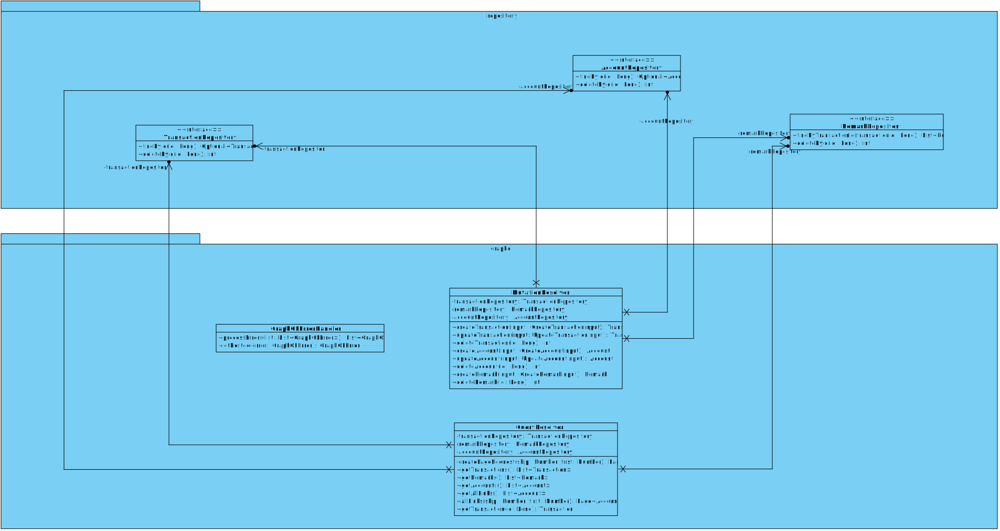

# UML diagram for Transaction Report Inquiry Services

## Sequence Diagram

###### Transaction Report Inquiry Service

## Class Diagram

###### Data Model

###### Repository and Utility

###### GraphQL and Repository

